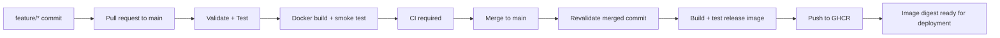

# devsecops-stuff

A small FastAPI/SQLite app with a DevOps delivery foundation for a SecDevOps
portfolio. Security tooling and deployment are left as future work.

## Delivery architecture



- `.github/workflows/ci.yml`: PRs targeting `main`, manual validation, and reusable
  validation called by the release workflow. `Validate` runs lint, formatting,
  dependency consistency, and Python/Jinja template compilation. `Test` runs unit
  and API tests against isolated SQLite databases. `Build` waits for both, builds
  the production image, and checks HTTP behavior in a fresh container.
- `CI required` runs even after failures and fails unless all three jobs succeed.
  Select this check in a branch rule for `main` after its first PR run. Require
  PRs and current checks before merging. Repository settings are configured
  manually; the workflow does not change them.
- `.github/workflows/release.yml`: pushes to `main` and version tags reuse CI before
  building a release image. The release image is loaded locally, smoke tested,
  and pushed without a second build. A failed check prevents publication.
- Python 3.12, hash-verified dependency locks, pip caching, Docker layer caching,
  job timeouts, and minimal token permissions are used throughout. PR CI can run
  without registry credentials. Only the release publish job has `packages: write`.

Use `feature/<change>` branches, open a PR to `main`, wait for `CI required`, and
merge. Main pushes revalidate the actual merged commit before publishing. No
feature-branch images are published. Release runs for a ref are serialized without
cancelling an in-progress push; GitHub may replace an older pending run.

## Local development

Prerequisites: Python 3.12, Docker with Linux containers, and GNU Make. Create and
activate a virtual environment first:

```bash
python -m venv .venv
source .venv/bin/activate
make install
make lint
make test
make build
make run
```

On Windows PowerShell, activate with `.\.venv\Scripts\Activate.ps1`. GNU Make is
optional: run the equivalent commands below, or the commands shown in `Makefile`.

```powershell
python -m pip install --require-hashes -r requirements-dev.txt
python -m ruff check app tests scripts
python -m ruff format --check app tests scripts
python -m pytest
python -m uvicorn app.main:app --reload --port 8080
```

| Command | Purpose |
| --- | --- |
| `make install` | Install the locked runtime and development dependencies |
| `make lint` | Validate Python lint and formatting |
| `make format` | Apply formatting and automatic lint fixes |
| `make test` | Run model unit tests and API/database tests |
| `make build` | Compile Python source and Jinja templates |
| `make run` | Start local development on port 8080 |
| `make docker-build` | Build the production image |
| `make docker-test` | Run isolated container smoke checks and clean up |
| `make docker-run` | Run the image with a persistent SQLite volume |
| `make lock` | Regenerate both dependency locks from the `.in` inputs |

Override `PYTHON`, `IMAGE`, or `PORT` as needed, for example
`make docker-run IMAGE=devsecops-stuff:local PORT=8081`.

Direct runtime versions live in `requirements.in`; development tools live in
`requirements-dev.in`. Generated `.txt` files pin transitive dependencies and
include hashes for supported platforms. Edit the inputs, run `make lock`, and
commit both generated files. The pinned `uv` tool is installed by `make install`.
For deliberate transitive upgrades, add `--upgrade` to the corresponding compile
command in `Makefile`, regenerate, and review the changes. CI installs the locks;
regeneration is a developer task.

## Docker and configuration

```bash
make docker-build
make docker-test
make docker-run
# Equivalent Docker commands:
docker build --provenance=false --sbom=false -t devsecops-stuff:local .
python scripts/docker_smoke.py devsecops-stuff:local
docker run --rm -p 8080:8080 -v ideas-data:/data devsecops-stuff:local
```

The image uses a Python 3.12 slim base pinned by digest, only runtime Python
dependencies, an unprivileged application user, Uvicorn on port 8080, and a
`/health` health check. `.dockerignore` limits the build context to runtime inputs.
CI/release currently build `linux/amd64`. Update the base digest deliberately and
run the same validation when refreshing it.

`DATABASE_PATH` defaults to `data/ideas.db` locally and `/data/ideas.db` in Docker.
Mount `/data` to preserve data between container replacements. A custom path must
be writable by the app user. Tests and smoke checks use disposable databases.
SQLite suits this single-instance demo; storage design needs revisiting before
running multiple replicas in Kubernetes. `/health` reports process readiness,
while the smoke checks also exercise database writes.

## GHCR releases

Publishing uses the workflow's `GITHUB_TOKEN` with `contents: read` and
`packages: write`; no personal access token or custom secret is needed. GitHub
Actions and organization/package permissions must allow the repository to publish.
If an existing package is reused, grant this repository Actions access to it.
See [GitHub's GHCR authentication documentation](https://docs.github.com/en/packages/working-with-a-github-packages-registry/working-with-the-container-registry#authenticating-in-a-github-actions-workflow).

The image name is `ghcr.io/<owner>/<repository>` in lowercase. OCI labels include
source repository, revision, and version through Docker's metadata action.

| Trigger | Published tags |
| --- | --- |
| Push/merge to `main` | `sha-<full-commit-sha>`, `main` |
| Tag `v1.2.3` | `sha-<full-commit-sha>`, `1.2.3` |
| Tag `v1.2.3-rc.1` | `sha-<full-commit-sha>`, `1.2.3-rc.1` |

Version tags should point to reviewed commits on `main`. Tag builds rerun CI.
Build metadata (`+suffix`) is not supported in Git version tags for this workflow.
There is no automatic `latest` tag. The workflow summary records all tags and the
immutable `ghcr.io/<owner>/<repository>@sha256:<digest>` reference. Use that digest
for future deployments: tags, including SHA-based tags, can be overwritten on a
rerun. Publication does not deploy the app or change package visibility.

## Future security and deployment work

These are extension points only; no scanners, SBOMs, signatures, attestations,
security policies, or vulnerability gates are configured.

| Future work | Exact insertion point |
| --- | --- |
| SAST | `ci.yml`, `FUTURE SOURCE CHECKS` comment: add a job after validation/tests |
| SCA | Same location; inspect `requirements.txt` and `requirements-dev.txt` |
| Secret scanning | Same location; add a job with the checkout/history depth the tool requires |
| Source gates | Add new job IDs to both `build.needs` and `ci-result.needs` |
| Container scanning | `release.yml`, `FUTURE CONTAINER SECURITY`, after release smoke tests and before GHCR login/push |
| SBOM generation | `release.yml`, `FUTURE SBOM`, against the exact built image before push |
| Artifact signing | `release.yml`, `FUTURE SIGNING`, against the pushed digest; registry-backed signing needs that digest first |
| Helm / Kubernetes / Argo CD | New deployment job/workflow consuming `publish.outputs.reference`; update GitOps manifests by digest |

If later policy requires signing before promotion to the delivery registry, add a
staging registry and a promotion step then. The present workflow exposes separate
build, test, and push stages so those decisions remain explicit.

## Application endpoints

- `GET /`, `GET /ideas`: HTML pages
- `GET /health`: process health
- `GET /api/ideas`, `POST /api/ideas`: list/create
- `GET /api/ideas/{id}`, `PUT /api/ideas/{id}`, `DELETE /api/ideas/{id}`: CRUD
